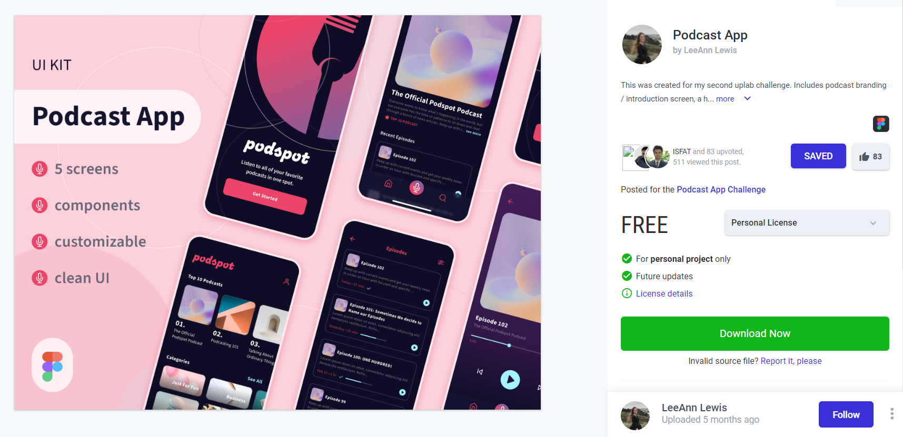
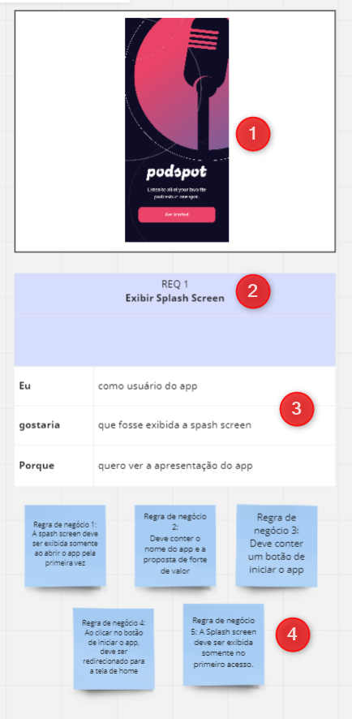

# Projeto Podcast APP

Este projeto foi criado com o propósito de práticar o **levantamento de requisito** de um projeto. Onde foi levado em consideração analisar um projeto do tipo Figma retirado do site UpsLabs onde vários designer tem a possibilidade de subir os seus projetos. Com isso irei demostrar a analise do projeto PodcastApp onde através do protótipo irei analisar os requisitos desejaveis para este projeto. 

## Protótipo
- Protótipo do Figma [PodcatApp](https://www.uplabs.com/posts/podcast-app-27e7dba2-b5d6-40f8-be0f-52d6710b9af7)

## Analise do projeto

A imagem a baixo irá indicar como foi feita a análise deste projeto, onde foi utilizado o **MIRO** para fazer a análise de forma visual. 

1. Indicação da imagem a ser analisada
2. Indicação de qual Requerimento iremos analisar, indicando seu numero e nome
3. Descrição em alto da funcionalidade, indicando o usuário que irá utilizar, a funcionalidade desejada e o porque da existencia deste funcionalidade. 
4. Listagem das regras de negócio a serem implementadas. 

### Referência da analise 

- REQ 1 Exibir Splash Screen

- REQ 2 Criar padrão de Header 

- REQ 3 TOP 10 Podcast

- REQ 4 Exibir as categorias de Podcast

- REQ 5 Exibir as recomendações

- REQ 6 TELA INICIAL DO PODCAST

- REQ 7 Exibir a lista de todos os episódio

- REQ 8 Exibição do Player de execução do Podcast