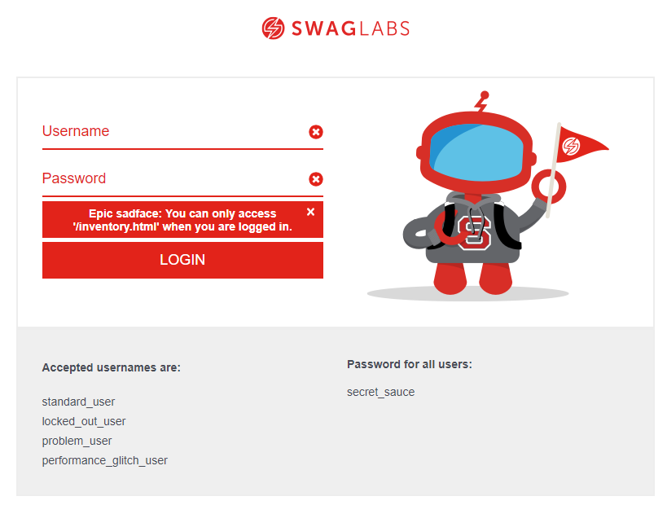
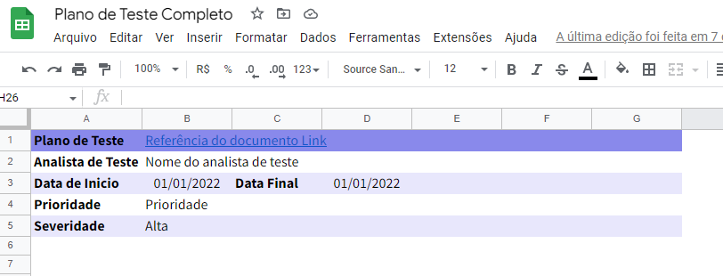

# Projeto Saucedemo

Este projeto foi criado com o propósito de práticar a criação e execução do **Plano de Teste** de um projeto. Onde foi levado em consideração analisar um site já existe, realizar levantamento dos seus requisitos, criação de  suites e casos de teste para execução. 

## Ferramentas

- Site utilizado para elaboração do Plano [Saucedemo](https://www.saucedemo.com)

- Excell para criação do Plano de Teste

## Plano de Teste 

### Apresentação do Plano 

### Apresentando a Suite 

